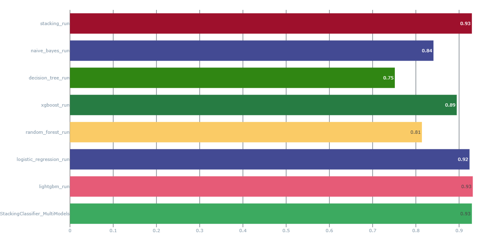
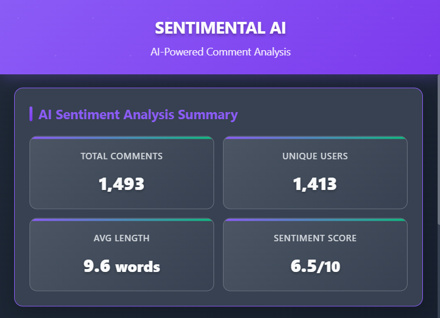

<div align="center">
<a></a>

# 🎭 SENTIMENTAL AI

### *AI-Powered YouTube Comment Sentiment Analysis*

*Unlock the emotions behind every comment with cutting-edge machine learning*

[](https://python.org)
[](https://flask.palletsprojects.com/)
[](https://lightgbm.readthedocs.io/)
[](https://dvc.org)
[](https://mlflow.org)
[](https://developer.chrome.com/docs/extensions/)

[](https://github.com/ArpitKadam/SentimentalAI/stargazers)
[](https://github.com/ArpitKadam/SentimentalAI/network/members)
[](https://dagshub.com/ArpitKadam/SentimentalAI)
[](LICENSE)

</div>

---

## 🌟 Overview

**SentimentalAI** is a comprehensive, production-ready sentiment analysis system that transforms YouTube video comments into actionable insights. Built with modern MLOps practices, it combines the power of machine learning with an intuitive user experience through a Chrome extension.

### ✨ Key Features

- 🧠 **Advanced ML Pipeline**: DVC-orchestrated workflow with automated data processing
- 🚀 **Real-time API**: High-performance Flask API for instant sentiment predictions  
- 🎨 **Interactive Chrome Extension**: Analyze YouTube comments with beautiful visualizations
- 📊 **MLflow Integration**: Complete experiment tracking and model versioning
- 🔄 **Reproducible Workflows**: Version-controlled data and model pipelines
- 📈 **Rich Analytics**: Sentiment trends, word clouds, and distribution charts

---

## 🏆 Model Performance

Our LightGBM model achieved **93.17% accuracy** across multiple sentiment classes:

```json
{
  "lightgbm": 0.9317,
  "logistic_regression": 0.9242,
  "stacking": 0.9296,
  "xgboost": 0.8946,
  "naive_bayes": 0.8408,
  "random_forest": 0.8140,
  "decision_tree": 0.7514
}
```

<div align="center">

</div>

---

## 📁 Project Structure

<details>
<summary>📂 <strong>Expand File Tree</strong></summary>

```
SentimentalAI/
├── 📁 Chrome-Extension/
│   ├── 📄 manifest.json
│   ├── 🎨 popup.html
│   └── ⚙️ popup.js
├── 🌐 Flask_API/
│   └── 🚀 main.py
├── 📓 Notebooks/
│   ├── 🔬 experiments1.ipynb
│   ├── 🔬 experiments2.ipynb
│   ├── 📊 accuracy.png
│   ├── 📈 model_comparison.json
│   └── 🎯 confusion_matrices/
├── 🧠 src/
│   ├── 📦 components/
│   │   ├── 📥 data_ingestion.py
│   │   ├── 🧹 data_preprocessing.py
│   │   ├── 🏗️ model_building.py
│   │   └── 📊 model_evaluation.py
│   ├── 🚨 exception/
│   │   └── 📝 __init__.py
│   ├── 📋 logger/
│   │   └── 📝 __init__.py
│   └── 🛠️ utils/
│       └── 📝 __init__.py
├── 📊 Artifacts/
│   ├── 📂 data_ingestion/
│   ├── 📂 data_preprocessing/
│   ├── 📂 model_building/
│   └── 📂 model_evaluation/
├── ⚙️ dvc.yaml
├── 🎛️ params.yaml
├── 📋 requirements.txt
├── 🔐 .env.example
└── 📖 README.md
```

</details>

---

## 🚀 Quick Start

### Prerequisites

- Python 3.8+
- Chrome Browser
- YouTube Data API v3 Key ([Get it here](https://console.cloud.google.com/apis))

### 🛠️ Installation

1. **Clone the repository**
   ```bash
   git clone https://github.com/ArpitKadam/SentimentalAI.git
   cd SentimentalAI
   ```

2. **Set up Python environment**
   ```bash
   python -m venv venv
   source venv/bin/activate  # On Windows: venv\Scripts\activate
   pip install -r requirements.txt
   ```

3. **Configure environment variables**
   ```bash
   cp .env.example .env
   # Edit .env with your MLflow credentials
   ```

4. **Run the ML Pipeline**
   ```bash
   dvc repro
   ```

5. **Start the Flask API**
   ```bash
   cd Flask_API
   python -m Flask_API.main
   ```

6. **Install Chrome Extension**
   - Open `chrome://extensions/`
   - Enable "Developer mode"
   - Click "Load unpacked" and select the `Chrome-Extension` folder

---

## 🎯 Usage

### 🔮 API Endpoints

#### Sentiment Prediction
```bash
curl -X POST http://localhost:5000/predict \
  -H "Content-Type: application/json" \
  -d '{"comments": ["This video is amazing!", "I hate this content"]}'
```

#### Generate Visualizations
```bash
# Word Cloud
curl -X POST http://localhost:5000/generate_wordcloud \
  -H "Content-Type: application/json" \
  -d '{"comments": ["great video", "love it", "amazing content"]}'

# Sentiment Chart  
curl -X POST http://localhost:5000/generate_chart \
  -H "Content-Type: application/json" \
  -d '{"sentiment_counts": {"1": 45, "0": 23, "-1": 12}}'
```

### 🎨 Chrome Extension

1. Navigate to any YouTube video
2. Click the SentimentalAI extension icon
3. Watch as comments are analyzed in real-time
4. Explore interactive charts and insights

<div align="center">

</div>

---

## 🔬 Development

### 📊 DVC Pipeline Commands

```bash
# Run complete pipeline
dvc repro

# Run specific stages
dvc repro data_ingestion
dvc repro data_preprocessing  
dvc repro model_building
dvc repro model_evaluation

# Check pipeline status
dvc status

# View pipeline DAG
dvc dag

# Compare metrics
dvc metrics diff
```

### 🧪 Testing Individual Components

```bash
# Test data ingestion
python -m src.components.data_ingestion

# Test preprocessing
python -m src.components.data_preprocessing

# Test model building
python -m src.components.model_building

# Test evaluation
python -m src.components.model_evaluation
```

---

## 📈 Model Details

### 🧮 Algorithm Specifications

- **Model**: LightGBM Classifier
- **Features**: TF-IDF Vectors (max 2000 features, 1-2 n-grams)
- **Classes**: 3-class sentiment (Negative: -1, Neutral: 0, Positive: 1)
- **Preprocessing**: Lowercasing, punctuation removal, stopword filtering, lemmatization

### 📊 Performance Metrics

| Model | Accuracy | Precision | Recall | F1-Score |
|-------|----------|-----------|--------|-----------|
| **LightGBM** | **93.17%** | 92.8% | 93.2% | 93.0% |
| Logistic Regression | 92.42% | 91.9% | 92.4% | 92.1% |
| Stacking Ensemble | 92.96% | 92.5% | 93.0% | 92.7% |

---

## 🌐 MLOps & Monitoring

### 📊 Experiment Tracking

- **MLflow**: Complete experiment lifecycle management
- **DagsHub**: Remote tracking and collaboration
- **Model Registry**: Versioned model artifacts

### 🔗 Links

- 📊 [**DagsHub Repository**](https://dagshub.com/ArpitKadam/SentimentalAI)
- 🔑 [**YouTube Data API Setup**](https://console.cloud.google.com/apis)
- 📚 [**MLflow Tracking**](https://dagshub.com/ArpitKadam/SentimentalAI/experiments)

---

## 🤝 Contributing

We welcome contributions!

1. Fork the repository
2. Create your feature branch (`git checkout -b feature/AmazingFeature`)
3. Commit your changes (`git commit -m 'Add some AmazingFeature'`)
4. Push to the branch (`git push origin feature/AmazingFeature`)
5. Open a Pull Request

---

## 📄 License

This project is licensed under the GPU-3.0 License - see the [LICENSE](LICENSE) file for details.

---

## 🙋‍♂️ Support

If you found this project helpful, please give it a ⭐️!

For questions and support:
- 📧 Email: arpitkadam922@gmail.com
- 💬 [Open an Issue](https://github.com/ArpitKadam/SentimentalAI/issues)
- 🐛 [Report Bugs](https://github.com/ArpitKadam/SentimentalAI/issues/new?template=bug_report.md)

---

<div align="center">

**Made with ❤️ by [Arpit Kadam](https://github.com/ArpitKadam)**

*"Understanding emotions, one comment at a time."*

[](https://github.com/ArpitKadam)
[](https://arpit-kadam.netlify.app/)
[](mailto:arpitkadam922@gmail.com)
[](https://www.linkedin.com/in/arpitkadam/)

</div>
